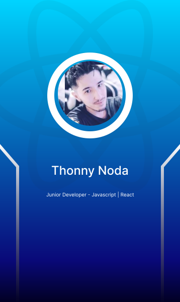

# Hi, I ´m Thonny Noda ＼(￣O￣)

Junior Developer || Frontend || React - Javascript

 

## 🚀 About

I have some reasons to say that I like to program, because when I'm coding I can't wait to go by, sometimes I spend hours and even days trying to solve a bug, but when it solves that adrenaline comes and the feeling that I managed to raise my level.

## 🛠 Skills

  
  
  
  
  

###

## Other
👩‍💻 I currently work in the information technology assistant in a hospital institution

🧠 I'm studying reactjs, react native and nodejs

🗣️ I can speak in portuguese and japanese

## 📫 Contact

  
  

###

